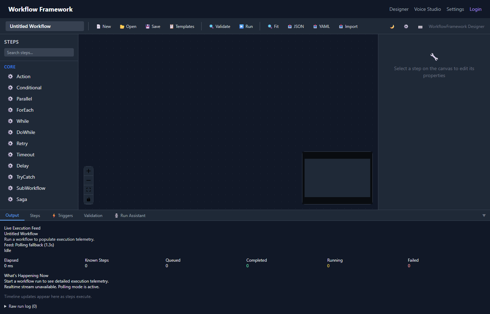
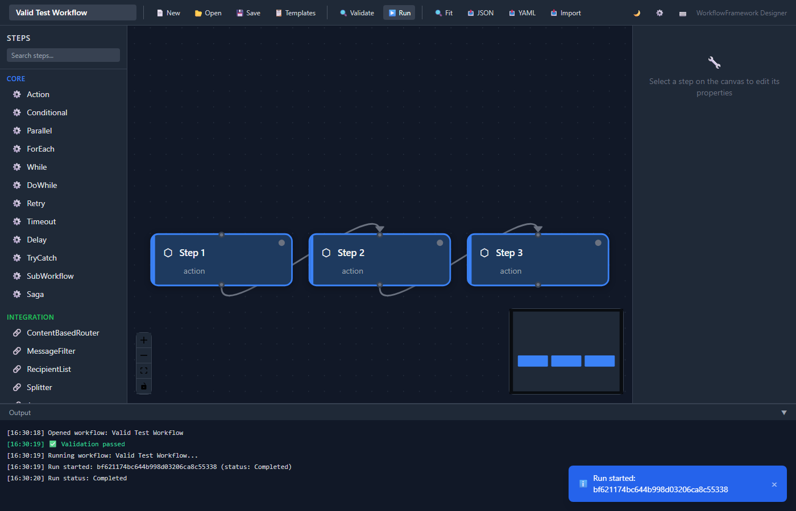
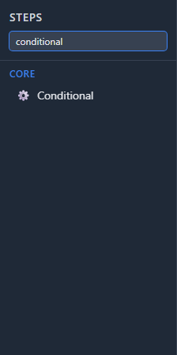
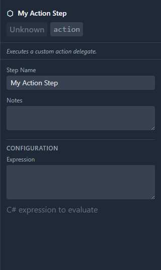
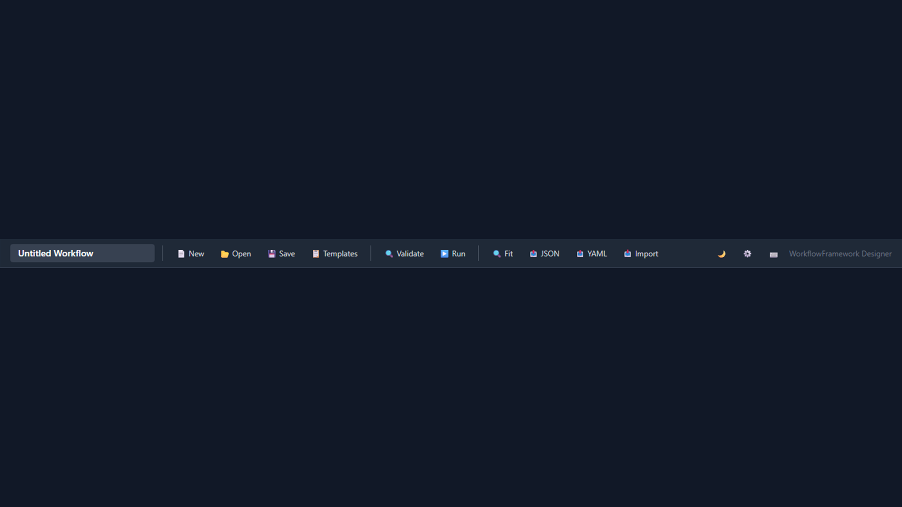

# Workflow Designer

The Workflow Designer is the core of the Dashboard — a visual canvas for building and editing workflows through drag-and-drop interactions.

*The full designer interface: step palette (left), canvas (center), properties panel (right).*

## Canvas

The canvas is powered by **React Flow** via JavaScript interop. It renders workflow steps as interactive nodes connected by edges that represent execution flow.

### Navigation

- **Pan** — Click and drag on empty canvas space
- **Zoom** — Mouse wheel or pinch gesture
- **Fit View** — Double-click the background or use the toolbar fit-view button
- **Select** — Click a node; Shift+click for multi-select
- **Delete** — Select node(s) and press Delete or Backspace
- **Deselect** — Press Escape or click empty canvas

### Connections

Draw connections by clicking an output handle (bottom of a node) and dragging to an input handle (top of another node). Connections snap to valid handles automatically.

> [!NOTE]
> Some step types have multiple output handles. For example, **conditional** has separate `then` and `else` outputs. **tryCatch** has `body` and `catch` outputs.

### Node Status Indicators

During [workflow execution](execution.md), nodes display real-time status through color coding:

| Color | Status | Description |
|---|---|---|
| Default (gray) | Idle | Not yet executed |
| Blue (pulsing) | Running | Currently executing |
| Green | Completed | Finished successfully |
| Red | Failed | Threw an error |

*Nodes showing running (blue), completed (green), and failed (red) states.*

## Step Palette

The left sidebar contains the **Step Palette** — a searchable, categorized list of all available step types.

*The step palette with category groupings and search.*

### Categories

| Category | Step Types |
|---|---|
| **Core** | action, conditional, parallel, loop, forEach, tryCatch, retry, timeout, delay, saga |
| **Integration** | contentRouter, messageFilter, splitter, aggregator, recipientList, wiretap, deadLetterChannel, enricher, normalizer, claimCheck, dynamicRouter, routingSlip |
| **AI/Agents** | llmCall, agentDecision, agentLoop, toolCall |
| **Data** | dataMap, validate, schemaValidate |
| **HTTP** | httpRequest, webhook |
| **Events** | publishEvent, subscribeEvent |
| **Human Tasks** | humanApproval, humanTask |

### Search

Type in the search box at the top of the palette to filter step types by name. The list updates as you type.

### Drag and Drop

Click and drag any step type from the palette onto the canvas to add it to your workflow. The step appears at the drop position with default configuration.

> [!TIP]
> See [Step Types](step-types.md) for detailed documentation on each step type's configuration and behavior.

## Properties Panel

The right sidebar shows the **Properties Panel** when a node is selected on the canvas. It displays schema-driven configuration fields specific to the selected step type.

*The properties panel showing configuration for a conditional step.*

### Field Types

The properties panel renders fields dynamically based on the step type's schema:

| Field Type | Rendered As |
|---|---|
| `text` | Text input |
| `number` | Numeric input with validation |
| `select` | Dropdown with predefined options |
| `bool` | Toggle switch |

### Schema Loading

Property schemas are loaded from the Dashboard API via the step catalog endpoint. If the API is unavailable, the panel falls back to a local **StepCatalog** embedded in the frontend.

> [!WARNING]
> When using the local StepCatalog fallback, custom step types registered via plugins will not appear in the properties panel. Ensure the API is running for full functionality.

### Editing

Changes in the properties panel are applied immediately to the workflow definition in memory. Press **Ctrl+S** to persist changes.

## Toolbar

The toolbar at the top of the designer provides quick access to common actions:

*The designer toolbar.*

| Button | Action | Shortcut |
|---|---|---|
| New | Create new workflow | Ctrl+N |
| Open | Open existing workflow | Ctrl+O |
| Save | Save current workflow | Ctrl+S |
| Run | Execute workflow | Ctrl+Enter |
| Validate | Run validation checks | — |
| Templates | Open template browser | — |
| Theme | Cycle dark/light/system | — |
| Help | Show keyboard shortcuts | ?/F1 |

The validate button displays a **badge** with the current error count when validation issues exist. See [Validation](validation.md) for details.
