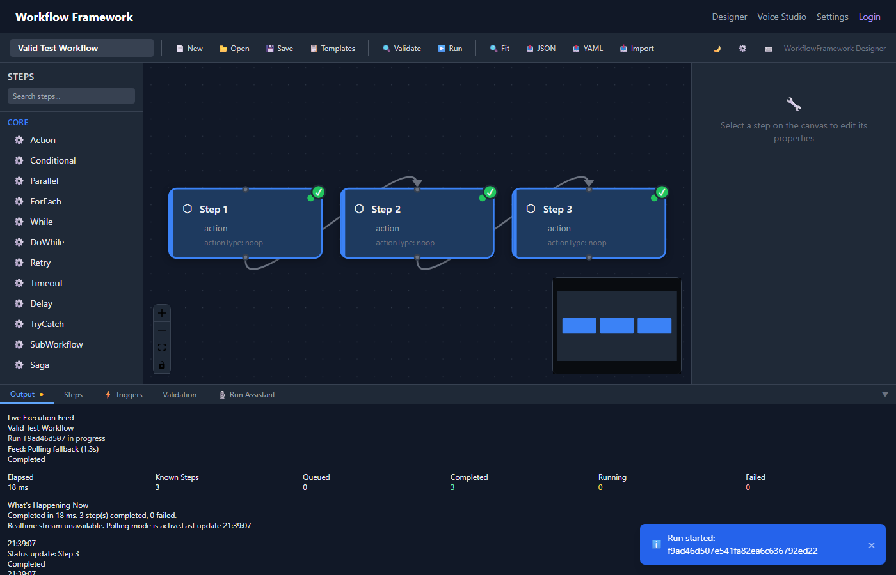

# Execution & Monitoring

The Dashboard provides real-time workflow execution with live status updates and a detailed execution log.

## Running a Workflow

Click **Run** in the toolbar or press **Ctrl+Enter** to execute the current workflow.

> [!NOTE]
> The workflow is [validated](validation.md) automatically before execution. If there are validation errors, the run is blocked and the validation panel opens.

## Execution Panel

When a workflow runs, the **Execution Panel** opens at the bottom of the designer. It displays a real-time, scrolling log of execution events.

*The execution panel showing real-time step progress.*

Each log entry shows:
- **Timestamp** — when the event occurred
- **Step name** — which step emitted the event
- **Status** — Started, Completed, or Failed
- **Duration** — time taken (for completed/failed steps)
- **Details** — error messages for failed steps, output summaries for completed steps

## Real-time Updates via SignalR

The Dashboard connects to the `WorkflowExecutionHub` SignalR hub for real-time execution updates. Events pushed to the client include:

| Event | Description |
|---|---|
| `StepStarted` | A step has begun executing — node turns blue |
| `StepCompleted` | A step finished successfully — node turns green |
| `StepFailed` | A step threw an error — node turns red |
| `WorkflowCompleted` | The entire workflow finished |
| `WorkflowFailed` | The workflow terminated with an error |

### Connection Status

A small indicator in the execution panel shows the SignalR connection state:

- 🟢 **Connected** — receiving real-time updates
- 🟡 **Reconnecting** — connection lost, attempting to reconnect
- 🔴 **Disconnected** — using polling fallback

### Polling Fallback

If the SignalR connection drops, the Dashboard automatically falls back to polling the run status API endpoint at 2-second intervals. Updates resume in real-time when SignalR reconnects.

> [!TIP]
> If you see the connection indicator stuck on yellow/red, check that the API project is running and the SignalR hub is mapped at `/hubs/execution`.

## Canvas Status Updates

During execution, nodes on the canvas update their visual state in real-time:

- **Idle** (gray border) — not yet reached
- **Running** (blue border, pulsing animation) — currently executing
- **Completed** (green border) — finished successfully
- **Failed** (red border) — encountered an error

This provides an at-a-glance view of workflow progress directly on the canvas.

## Run History

View all past runs for a workflow by clicking the **History** button in the execution panel.

*Run history showing past executions with status and duration.*

Each run entry shows:
- Run ID
- Start/end timestamps
- Overall status (Completed, Failed, Cancelled)
- Duration
- Step-level results (expandable)

Click a run to view its full execution log in the execution panel.

## Cancelling Runs

Click the **Cancel** button in the execution panel to abort a running workflow. The current step completes (or times out), then execution stops. Cancelled runs are marked with a `Cancelled` status in run history.
