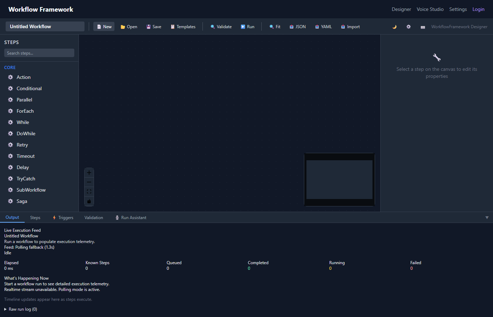

# Getting Started

This guide walks you through setting up the WorkflowFramework Dashboard and creating your first visual workflow.

## Prerequisites

- **.NET 10 SDK** or later
- **.NET Aspire workload** — install with:

```bash
dotnet workload install aspire
```

- A modern browser (Chrome, Edge, Firefox)

> [!NOTE]
> The Dashboard uses .NET Aspire for orchestration. If you're new to Aspire, see the [official Aspire documentation](https://learn.microsoft.com/dotnet/aspire/).

## Installation

### 1. Add the Dashboard API

In your API project, register the Dashboard services and endpoints:

```csharp
// Program.cs (Dashboard.Api or your host project)
var builder = WebApplication.CreateBuilder(args);

// Register workflow dashboard services (in-memory stores, validators, etc.)
builder.AddWorkflowDashboardApi();

var app = builder.Build();

// Map all dashboard API endpoints (workflows, runs, templates, audit, etc.)
app.MapWorkflowDashboardApi();

// Map the SignalR hub for real-time execution updates
app.MapHub<WorkflowExecutionHub>("/hubs/execution");

app.Run();
```

### 2. Configure the Aspire AppHost

In your `Dashboard.AppHost` project:

```csharp
var builder = DistributedApplication.CreateBuilder(args);

var api = builder.AddProject<Projects.Dashboard_Api>("dashboard-api");

builder.AddProject<Projects.Dashboard_Web>("dashboard-web")
    .WithReference(api)
    .WithExternalHttpEndpoints();

builder.Build().Run();
```

### 3. Run the Application

```bash
cd Dashboard.AppHost
dotnet run
```

The Aspire dashboard will open automatically. From there, navigate to the **Dashboard.Web** endpoint (typically `https://localhost:5001`).


*The .NET Aspire dashboard showing Dashboard.Web and Dashboard.Api resources.*

## Your First Workflow

### Step 1: Create a New Workflow

Click **New** in the toolbar (or press **Ctrl+N**). Enter a name and optional description.


*The new workflow dialog.*

### Step 2: Add Steps from the Palette

The **Step Palette** on the left sidebar shows all available step types organized by category. Search or browse to find the step you need, then **drag and drop** it onto the canvas.

For a simple workflow, try:
1. Drag an **action** step onto the canvas
2. Drag a **conditional** step below it
3. Drag two more **action** steps for the then/else branches

### Step 3: Connect Steps

Click and drag from a step's output handle to another step's input handle to create a connection. Connections define execution flow.

### Step 4: Configure Step Properties

Click a step on the canvas to open the **Properties Panel** on the right. Fill in the schema-driven configuration fields (name, parameters, expressions, etc.).

### Step 5: Validate

Click the **Validate** button in the toolbar. The [Validation Panel](validation.md) shows any errors or warnings. Fix them before running.

### Step 6: Run

Click **Run** (or press **Ctrl+Enter**). The [Execution Panel](execution.md) opens at the bottom, showing real-time log entries as each step executes. Node colors update on the canvas to reflect status:

- 🔵 **Blue** — Running
- 🟢 **Green** — Completed
- 🔴 **Red** — Failed

### Step 7: Save

Press **Ctrl+S** to save. The workflow is [auto-versioned](versioning.md) with each save.

> [!TIP]
> Use **Templates** to jumpstart common patterns. Click the template icon in the toolbar to browse pre-built workflows. See [Templates](templates.md) for details.

## Next Steps

- [Workflow Designer](designer.md) — Deep dive into the canvas, palette, and properties panel
- [Step Types](step-types.md) — Reference for all 30 step types
- [Workflow Management](management.md) — Save, export, import, and organize workflows
