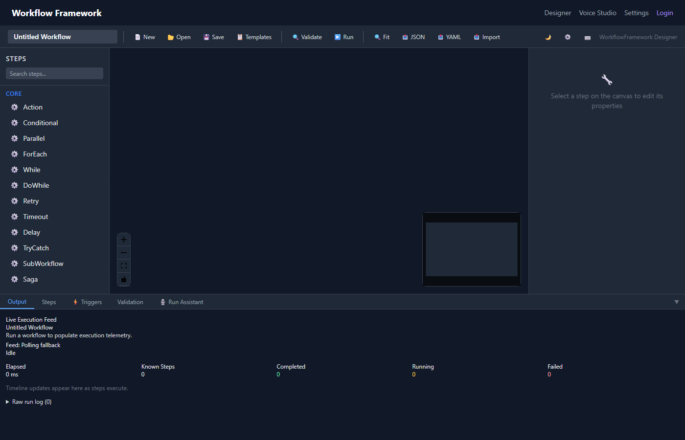

# WorkflowFramework Dashboard

The WorkflowFramework Dashboard is a visual workflow designer and execution monitor built with **Blazor Server** and **.NET Aspire**. It provides a drag-and-drop canvas for building workflows, real-time execution monitoring, versioning, audit trails, and more — all through a modern dark-themed web interface.


*The main dashboard interface showing the workflow designer canvas with step palette and properties panel.*

## Architecture

The Dashboard is composed of four projects:

| Project | Purpose |
|---|---|
| **Dashboard.Web** | Blazor Server frontend with Tailwind CSS styling and React Flow canvas (via JS interop) |
| **Dashboard.Api** | Minimal API backend with in-memory stores for workflows, runs, versions, and audit entries |
| **Dashboard.AppHost** | .NET Aspire orchestration — wires up service discovery, health checks, and telemetry |
| **Dashboard.ServiceDefaults** | Shared OpenTelemetry and health check configuration |

## Key Features

- **[Visual Workflow Designer](designer.md)** — React Flow-based canvas with drag-and-drop step palette and schema-driven properties panel
- **[30 Built-in Step Types](step-types.md)** — Core, Integration (EIP), AI/Agents, Data, HTTP, Events, and Human Tasks
- **[Workflow Management](management.md)** — Create, save, duplicate, search, tag, export/import workflows
- **[Templates](templates.md)** — Start from pre-built workflow templates with difficulty levels
- **[Real-time Execution](execution.md)** — Run workflows and monitor progress via SignalR with live node status updates
- **[Validation](validation.md)** — 30-type-aware validator with cycle detection, click-to-select errors, and pre-run blocking
- **[Versioning](versioning.md)** — Auto-versioned saves with history, restore, and diff
- **[Audit Trail](audit.md)** — Full action logging with filtering and IP tracking
- **[Keyboard Shortcuts](shortcuts.md)** — Ctrl+S, Ctrl+Enter, and more for power users
- **[Theme & Preferences](preferences.md)** — Dark/light/system themes, grid, minimap, auto-save settings

## Quick Start

```csharp
// In your API project's Program.cs
builder.AddWorkflowDashboardApi();

var app = builder.Build();
app.MapWorkflowDashboardApi();
app.MapHub<WorkflowExecutionHub>("/hubs/execution");
app.Run();
```

See the [Getting Started](getting-started.md) guide for the full setup walkthrough.

## Related Documentation

- [Core Concepts](../core-concepts.md) — Workflow fundamentals
- [Fluent Builder](../fluent-builder.md) — Code-first workflow building
- [Enterprise Integration Patterns](../integration-patterns.md) — Patterns used by integration step types
- [AI Agents](../ai-agents.md) — AI/Agent step capabilities
- [Diagnostics](../diagnostics.md) — OpenTelemetry integration shared with the dashboard
