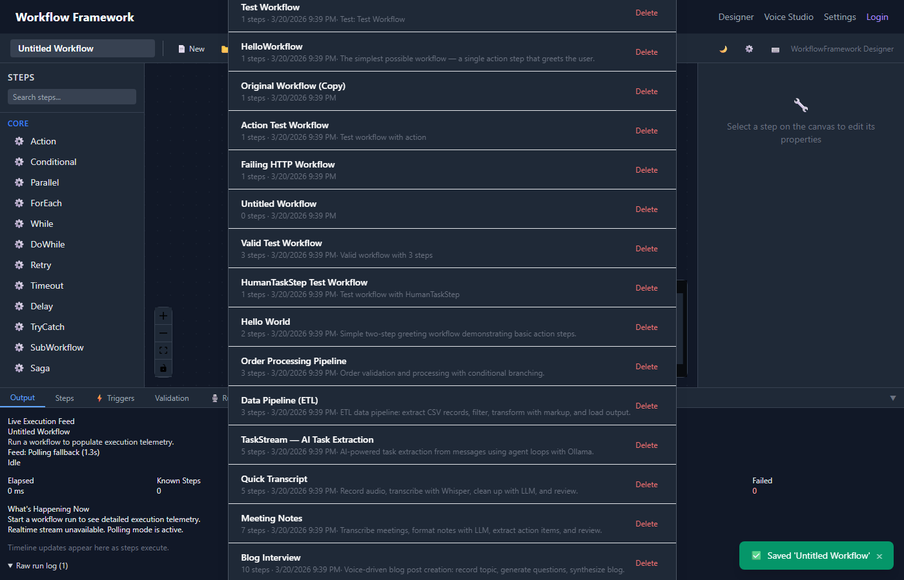

# Workflow Management

The Dashboard provides full lifecycle management for workflows — creating, saving, organizing, searching, and importing/exporting.

## Creating Workflows

### New Blank Workflow

Click **New** in the toolbar or press **Ctrl+N**. A dialog prompts for:

- **Name** (required) — unique workflow identifier
- **Description** (optional) — what the workflow does
- **Tags** (optional) — comma-separated labels for organization

*Creating a new workflow.*

### From Template

Click the **Templates** button in the toolbar to browse pre-built workflows. Selecting a template creates a new workflow pre-populated with steps and connections. See [Templates](templates.md).

## Saving

Press **Ctrl+S** or click **Save** in the toolbar. Each save automatically creates a new [version](versioning.md) and logs an [audit entry](audit.md).

> [!TIP]
> Enable **auto-save** in [Preferences](preferences.md) to save automatically at a configurable interval (default: 30 seconds).

## Opening & Loading

Press **Ctrl+O** or click **Open** to browse existing workflows. The workflow list shows:

- Workflow name and description
- Tags
- Last modified date
- Version count

*The workflow browser with search and tag filtering.*

## Search & Filter

The workflow browser supports:

- **Text search** — filters by workflow name and description
- **Tag filtering** — click tags to filter; multiple tags use AND logic

## Duplicating

From the workflow browser, use the **Duplicate** action on any workflow. This creates a copy with "(Copy)" appended to the name, preserving all steps and connections but starting fresh version history.

## Deleting

Delete workflows from the browser via the **Delete** action. Deletion is logged in the [audit trail](audit.md).

> [!WARNING]
> Workflow deletion is permanent. All versions and run history for the workflow are also removed.

## Tags

Tags help organize workflows. Add tags when creating or editing a workflow. Tags appear as colored chips in the workflow browser and can be used for filtering.

Common tag conventions:
- Environment: `production`, `staging`, `dev`
- Domain: `billing`, `onboarding`, `notifications`
- Status: `draft`, `active`, `deprecated`

## Export & Import

### Export

Export workflows from the browser or the currently open workflow via the toolbar menu:

- **JSON** — full workflow definition including metadata
- **YAML** — human-readable format, ideal for version control

The exported file contains the complete workflow definition: steps, connections, metadata, and configuration.

> [!NOTE]
> For details on the serialization format, see [Configuration](../configuration.md).

### Import

Click **Import** in the toolbar to load a workflow from a JSON or YAML file. The imported workflow is validated and created as a new workflow with fresh version history.

> [!TIP]
> Import is useful for sharing workflows between environments, moving from development to production, or restoring from backups.
