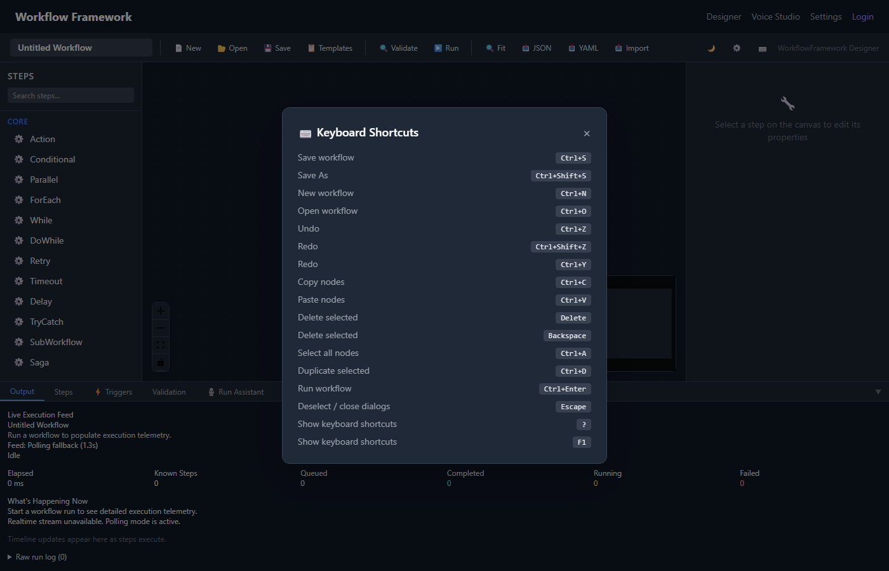

# Keyboard Shortcuts

The Dashboard supports keyboard shortcuts for common actions, implemented via JavaScript interop with the Blazor frontend.

## Shortcut Reference

| Shortcut | Action |
|---|---|
| **Ctrl+S** | Save workflow |
| **Ctrl+N** | New workflow |
| **Ctrl+O** | Open workflow browser |
| **Ctrl+Enter** | Run workflow |
| **Delete** / **Backspace** | Delete selected node(s) |
| **Escape** | Deselect all / close panel |
| **?** or **F1** | Open help modal |

*The help modal showing all keyboard shortcuts.*

## Notes

- Shortcuts are captured at the document level via JS interop and forwarded to Blazor components
- When a text input is focused, letter-based shortcuts (like `?`) are disabled to avoid conflicts
- **Ctrl+S** prevents the browser's default save-page behavior
- The help modal (`?`/`F1`) displays the complete shortcut reference and links to this documentation

> [!TIP]
> Press **?** at any time to see the shortcut reference without leaving the designer.
