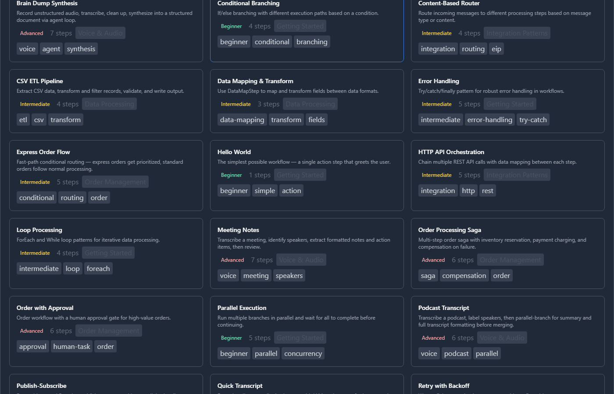

# Templates

Templates are pre-built workflow patterns that give you a head start. Instead of building from scratch, pick a template and customize it.

## Template Browser

Click the **Templates** button in the toolbar to open the template browser modal.

*The template browser showing categories, tags, and difficulty levels.*

### Browsing

Templates are organized by:

- **Category** — matches step categories (Core Patterns, Integration, AI/Agents, HTTP, etc.)
- **Tags** — descriptive labels like `error-handling`, `data-pipeline`, `approval`
- **Difficulty** — Beginner, Intermediate, or Advanced

Filter by category or search by name to find relevant templates.

### Difficulty Levels

| Level | Description |
|---|---|
| **Beginner** | Simple patterns with 2–5 steps. Good for learning the designer. |
| **Intermediate** | Multi-branch workflows with error handling, 5–15 steps. |
| **Advanced** | Complex patterns with parallel execution, sagas, or AI agents. |

## Using a Template

1. Browse or search for a template
2. Click to preview the template description and step summary
3. Click **Use Template** to create a new workflow from it

Using a template:
- Creates a new workflow with the template's steps and connections pre-configured
- Assigns a default name (editable)
- Logs a `template_use` entry in the [audit trail](audit.md)
- Starts fresh version history (version 1)

> [!TIP]
> Templates are starting points — customize freely after creation. The original template is not modified.

## Built-in Template Categories

| Category | Examples |
|---|---|
| **Core Patterns** | Sequential pipeline, conditional branching, parallel fan-out/fan-in, retry with backoff |
| **Integration** | Content-based routing, splitter-aggregator, dead letter handling, claim check |
| **AI/Agents** | LLM chain, agent decision loop, multi-agent collaboration |
| **HTTP** | REST API orchestration, webhook handler, API polling |
| **Data** | ETL pipeline, schema validation, data transformation |
| **Human Tasks** | Approval workflow, task assignment with escalation |
| **Error Handling** | Try-catch-retry, saga compensation, timeout with fallback |
