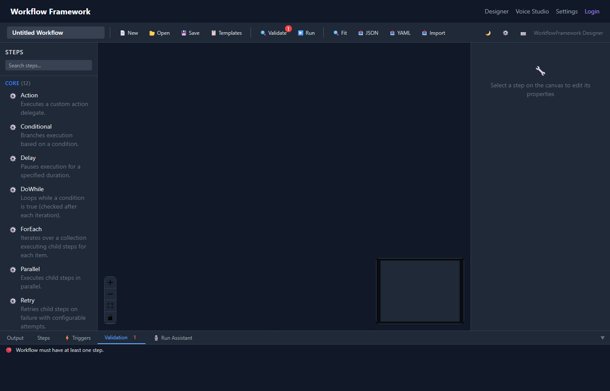

# Validation

The Dashboard includes a comprehensive workflow validator that checks for structural errors, missing configuration, and logical issues before execution.

> [!NOTE]
> For validation of workflow definitions in code, see [Validation](../validation.md).

## Validation Rules

The validator understands all 30 built-in step types and enforces these rules:

### General Rules

| Rule | Severity | Description |
|---|---|---|
| Name required | Error | Every workflow must have a name |
| Steps exist | Error | Workflow must contain at least one step |
| Valid step types | Error | All steps must be one of the 30 known types |
| No duplicate names | Error | Step names must be unique within a workflow |
| DAG cycle detection | Error | Workflow graph must be acyclic (no circular dependencies) |

### Step-Specific Rules

| Step Type | Rule | Severity |
|---|---|---|
| **conditional** | Must have `then` branch connected | Error |
| **conditional** | Should have `else` branch connected | Warning |
| **retry** | `maxAttempts` must be specified and ≥ 1 | Error |
| **timeout** | `seconds` must be specified and > 0 | Error |
| **timeout** | Must have an inner child step connected | Error |
| **tryCatch** | Must have `body` branch connected | Error |
| **parallel** | Must have at least one child step | Error |

## Using Validation

### Manual Validation

Click **Validate** in the toolbar to run validation on demand. Results appear in the **Validation Panel** below the canvas.

### Auto-Validation Before Run

When you click **Run** (or Ctrl+Enter), validation runs automatically. If errors are found, execution is **blocked** and the validation panel opens to show the issues.

> [!WARNING]
> Warnings do not block execution — only errors do. Review warnings to catch potential issues.

### Toolbar Badge

The validate button in the toolbar displays a red **badge** with the error count whenever validation issues exist. This updates after each validation run.


*The toolbar showing a validation error badge.*

## Validation Panel

The validation panel shows all errors and warnings in a list:


*The validation panel with errors and warnings.*

Each entry shows:
- **Severity icon** — ❌ Error or ⚠️ Warning
- **Message** — description of the issue
- **Step name** — which step has the problem

**Click any entry** to select and focus the offending node on the canvas, making it easy to find and fix issues.

## API Endpoints

The Dashboard API exposes validation endpoints for programmatic use:

### Validate by Workflow ID

```http
POST /api/workflows/{id}/validate
```

Validates a saved workflow by its ID. Returns validation results.

**Response:**
```json
{
  "isValid": false,
  "errors": [
    {
      "severity": "Error",
      "message": "Conditional step 'checkAge' must have a 'then' branch",
      "stepName": "checkAge"
    }
  ],
  "warnings": [
    {
      "severity": "Warning",
      "message": "Conditional step 'checkAge' has no 'else' branch",
      "stepName": "checkAge"
    }
  ]
}
```

### Validate Inline Definition

```http
POST /api/workflows/validate
Content-Type: application/json

{
  "name": "my-workflow",
  "steps": [ ... ],
  "connections": [ ... ]
}
```

Validates a workflow definition without saving it. Useful for CI/CD pipelines or external tooling.
